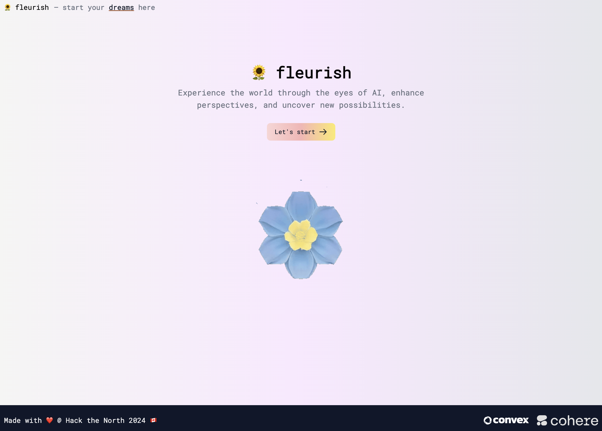
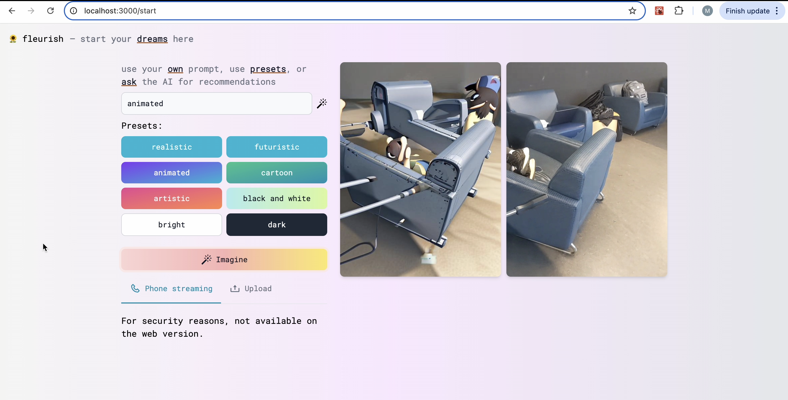

# 🌸 Fleurish

> **Imagine turning any image into a dynamic animation in just seconds—no design or animation skills needed. With Fleurish, static visuals come to life with a flourish at the press of a button.**

---

## 🧠 Inspiration

There are many text-to-image and image-to-text AI generators, and a few image-to-video ones. But from our research, we found **no existing AI generator** that converts **live images to video (.gif)**.

We wanted to fill this gap — and so, we created **Fleurish**!

---

## 💡 What It Does

- Upload an image
- Choose a theme
- Click **Imagine**

→ Get an **AI-generated gif** based on your input in seconds.

You can also connect your **phone camera** to send **live image feeds** to the app and generate gifs in real time.

---

## ⚙️ How We Built It

- Backend: **Convex template** with built-in **Replicate** integration  
- AI Model: [DreamShaper7-Img2Img-LCM on Replicate](https://replicate.com/lucataco/dreamshaper7-img2img-lcm)  
- Real-Time Video:  
  - RTC peer connection to stream camera feed to a Python backend  
  - Backend compresses and forwards image to frontend  
- Frontend: Built in **Next.js** using **WebSocket API**

---

## 🧩 Challenges

- Finding a **model that gave quality results** was time-consuming
- Integrating Replicate API and RTC/WebSocket for live updates was new territory
- We had **no prior experience** with generative image AI, WebSocket API, or RTC

---

## 🏆 Accomplishments

- **Highly optimized gif generation** (~1–2 seconds latency)
- Output themes and gif quality are **accurate and consistent**
- Seamless **live camera feed integration**

---

## 📚 What We Learned

- How to use **Convex**, **WebSocket API**, and **RTC peer connections**
- Core principles of **image generative AI** (very different from text generation)
- End-to-end **integration of multiple modern web and AI technologies**

---

## 🚀 What's Next

- Use **faster, higher-quality AI models**
- Add **user session management** to prevent user overlap

---

## 🛠️ Built With

- [Cohere](https://cohere.com)
- [Convex](https://convex.dev)
- [Next.js](https://nextjs.org)
- [Python](https://www.python.org)
- [Replicate](https://replicate.com)
- WebSocket API
- RTC Peer Connection

---

## 🔗 Try It Out

- 🔗 **GitHub Repo**: [https://github.com/htn-2024-amtz/HTN-2024](https://github.com/htn-2024-amtz/HTN-2024)
- 🔗 **Devpost Page**: [https://devpost.com/software/fleurish](https://devpost.com/software/fleurish)
- ▶️ **YouTube Demo**: [https://youtu.be/N-FeuSmbEqA](https://youtu.be/N-FeuSmbEqA)
